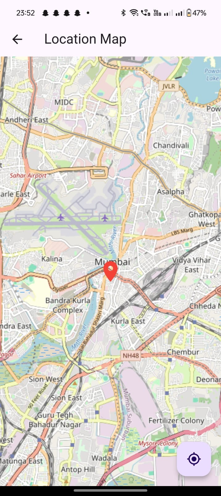
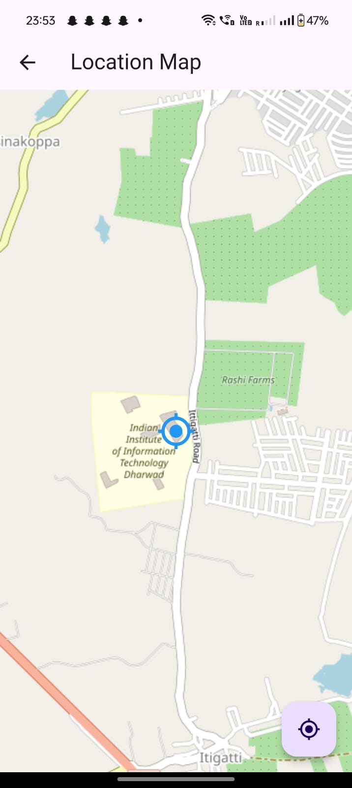

# Location-Based Flutter App

## Objective
This Flutter app allows users to input a location (city name, address, or coordinates) and displays it on a map. The purpose of this project is to demonstrate my ability to handle user input, integrate maps, and follow best coding practices in Flutter. 

## Features
1. **Location Input Screen**: 
   - A simple interface where users can input a location.
   - Basic validation ensures that the input is not left empty.
   - A button directs the user to the map display screen.

2. **Location Display on Map**:
   - Displays the entered location with a marker on a map.
   - Integrates a Flutter package to handle map rendering (e.g., `flutter_map` or `google_maps_flutter`).
   - Optionally, the user can switch between map types (satellite, terrain, etc.).
   - Includes error handling for invalid locations or connection issues.

3. **Bonus Features**:
   - Option to detect and display the user’s current location with a marker.
   - Toggle between different map types for better user experience.

## App Structure
- **First Screen**:  
  - A text field for location input, with validation and error messages for empty fields.
  - A button to proceed to the next screen after valid input.
  
- **Second Screen**:
  - Loads a map using the input location from the first screen.
  - Displays a marker on the map at the location entered.
  - Optional: Button to switch between map types (satellite, terrain, normal).
  - Optional: Button to detect and display the user's current location.

## Screenshots

### 1. Location Input Screen


### 2. Display Any Location on Map


### 3. Display Current Location on Map


### Demo


## How to Run the App

### Prerequisites
- Flutter SDK installed on your system.
- A map API key if using a map provider like Google Maps (for `google_maps_flutter`).
- An emulator or connected physical device to test the app.

### Steps to Run:
1. **Clone the Repository**:
   ```bash
   git clone https://github.com/HiBorn4/Reside_Locator.git
   cd Reside_Locator
   ```

2. **Install Dependencies**:
   Run the following command in the project directory to fetch all necessary packages:
   ```bash
   flutter pub get
   ```

3. **Run the App**:
   Launch the app on an emulator or a physical device:
   ```bash
   flutter run
   ```

### Optional Features:
- To enable the bonus features (switch map types, detect current location), make sure the device or emulator has location services enabled.

## Code Quality and Best Practices
- **Modular Code**: The code is separated into different files for better maintainability (e.g., screens, services, and widgets).
- **Comments**: Relevant comments are added to explain key functions, classes, and logic.
- **State Management**: Basic state management is used to manage user input and location rendering.
- **Error Handling**: Graceful handling of errors like invalid locations, empty input fields, and API errors.

## Packages Used
- `flutter_map` : For map rendering and interaction.
- `geolocator`: For detecting the user’s current location (optional).
- `provider` and `setState`: For state management (optional, depending on implementation).

## Future Improvements
- Enhance error handling for network-related issues.
- Allow users to save and revisit locations.
- Implement reverse geocoding for better user experience.

## Conclusion
This app demonstrates my understanding of Flutter development, including UI design, state management, and third-party package integration. I am confident in my ability to adapt to different Flutter challenges and build scalable, maintainable applications.

---

Feel free to reach out if you have any questions or need further clarification.
